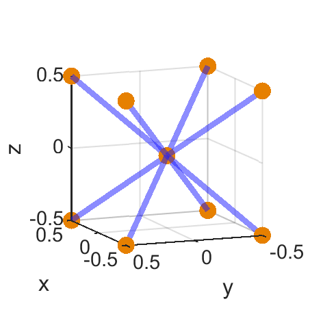
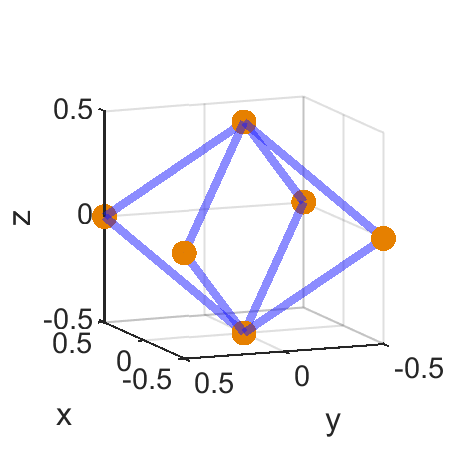
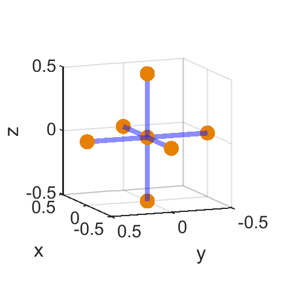
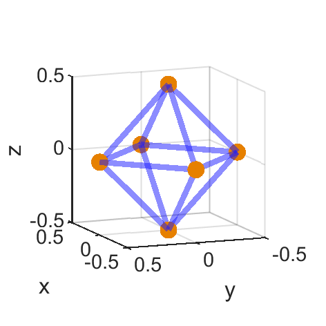
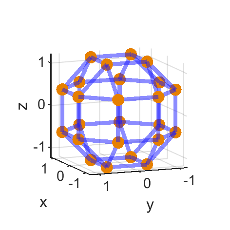
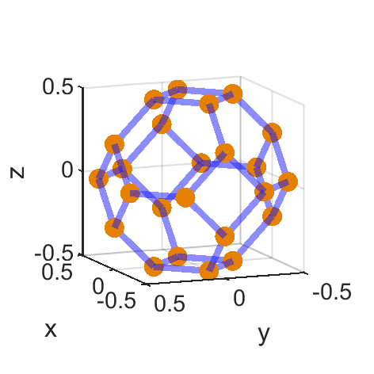
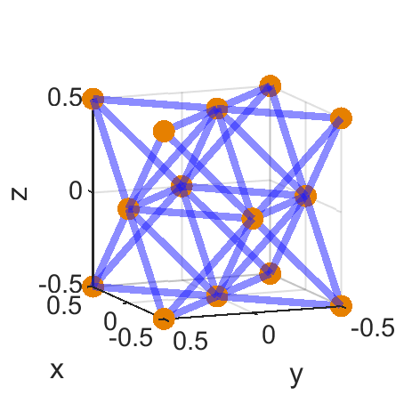
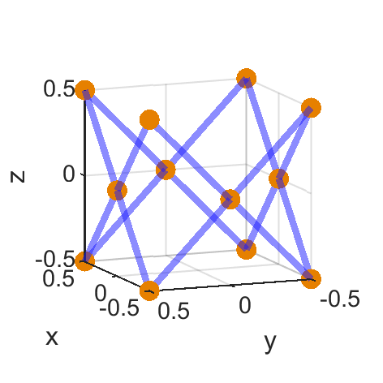
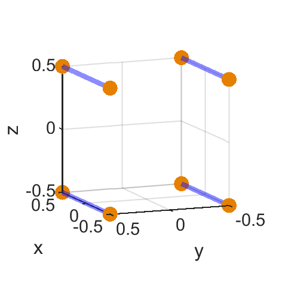

# PLG

A group of functions that enable the programmatic lattice generation (PLG).

These can be built up form basic unit cells as well as transformed scaled and joined.

Author(s): Matthew McMillan, David downing, Martin Leary

TODO

*   [critical] [paper] fill out tech stack table.
*   [low] better comments in methods - started for PLG.

DONE
*   [critical] radial code fold in.
*   [critical] demo for radial.
*   [medium] fold in david unit cell plots / automate
*   [critical] test demos in the new format.
*   [critical] custom -> .lattice file
*   [critical] update tests to work in the new format.
*   [critical] other BCC

LAST UPDATE: 08.12.2021

[TOC]

# General use

The general overview of use for the PLG is as follows:

1. Define dimensions and replications at minimum using the **set** method.
2. [optional] define origin and base flat, see properties section for the full list.
3. Define the unit cell using the **defineUnit** method.
4. Apply replications using the **cellReplication** method.
5. [recommended] clean duplicate nodes and struts using **cleanLattice**.
6. [optional] perform geometric transformations.
7. [optional] combine with other PLG objects.
8. save the data using a **save** method.

```matlab
% dia, usX,usY,usZ, repX,repY,repZ must be defined to use this example
obj = PLG() % no input creates an empty object
obj = set(obj,'resolution',20);
obj = set(obj,'sphereResolution',12);
obj = set(obj,'strutDiameter',dia);
obj = set(obj,'sphereDiameter',1.5*dia);
obj = set(obj,'sphereAddition',true); % default value is false
obj = set(obj,'unitSize',[usX,usY,usZ]);
obj = set(obj,'replications',[repX,repY,repZ]);
obj = defineUnit(obj,{'bcc','zRods'});
obj = cellReplication(obj); % requires the replications to be set
obj = cleanLattice(obj); % remove any vertices and struts that are coincident
save(obj); % uses a gui save tool
```
Be aware of the following:

-   Defining a unit cell always overwrites replication information.
-   cellReplication **must** be performed even if the replication is [1,1,1].
-   cleanLattice merges spatially coincident struts and nodes which may lead to different diameters then expected for custom built organic lattices.

## Methods

The following is a list of methods and a quick overview of their function, it should obvious from the name what it is they do.
- PLG: Initialise a PLG object: 0 inputs is an empty object, 1 input loads an existing custom file.
- set: properties are protected (read-only) and can be adjusted using this method. Properties are set using name value pairs.
- defineUnit: used to define the individual unit cell
- cellReplication: replicates a unit cell based on inputs
- cleanLattice: removes duplicate vertices or faces and orders the vertices in Z
- scale: resize the existing structure
- translate: translates the lattice structure.
- rotate: rotates the lattice structure
- plus:   The plus operator `+` is overloaded. This allows the combination of two PLG objects and is usefull for generating composite lattices.
- plot: displays a rendering of the beam model that represents the lattice.
- save: this method saves data to a custom file.

## Available unit cells
The following is a list of presently available unit cells. Custom unit cells can be created from any custom file see **generating a unit cell** for structure of xml file:

### bcc
Cross from each corner to the centre. 



### bccZoffset
This is the default BCC but shifted half a unit cell across. This results in a BCC lattice when repartitions are used but with no isolated struts on the edges.




### centreCross
Cross from the centre of each face to the centre of the unit cell.



### diamond
A diamond unit cell that connects the centres of each face together.



### generalCorner 
a shape that allows for joining of a unit cell at 90 and 45 degrees about all axis where its scaler value is the size of the unit cell you wish to attach too, See complex example. This unit cell is larger then the default of -0.5 - 0.5.



### horizontalFaceRods 
X shape on the two planes, top and bottom,that are perpendicular to the z axis.


### kelvinCell
The [Kelvin Cell](https://iopscience.iop.org/article/10.1088/1742-6596/158/1/012005/pdf), or tetrakaidecahedron, consists of six flat quadrilateral and eight hexagonal faces, which have a subtle curvature. It can be packed to fill all space, in a body-centred cubic arrangement.



### octetTruss
A [octet truss](https://www.sciencedirect.com/science/article/abs/pii/S0022509601000102) unit cell is made up of a series of octets, triangular pyramids.




### verticalFaceRods   
X shape on all the faces that are <br>NOT perpendicular to the z axis.



### xRods
Struts on all edges of the cube that are parallel to the x axis.

 

### yRods
Struts on all edges of the cube that are parallel to the y axis.

 

### zRods
Struts on all edges of the cube that are parallel to the z axis.


## Properties
properties of the PLG are defined using the set method to ensure that only the correct type can be used.
``` matlab
obj = set(obj,'name',value);
```
* resolution - resolution of the struts - scaler integer
* strutDiameter - strut diameter - scaler float
* sphereAddition - determines whether to add spheres to the structure - logical (true or false)
* sphereResolution - required if sphereAddition is true
* sphereDiameter - required if sphereAddition is true
* baseFlat - flattens the spheres at minimum z height vertices to create a flat base for supports - logical (true or false) - does nothing if sphereAddition is false
* unitSize - specifies the size of a single unit in a lattice - 3x1 vector of floats
* replications - specifies the number of copies of the unit cell - 3x1 vector of integers
* origin - starting location for the centre of the initial unit cell - 3x1 vector of floats - default value is [0,0,0]

# Testing

Tests are run using `runTest(tag)` and all tests will be run by default if no tag is specified. It a tag string is specified all matches will be run. The PLG consists of the following unit test classes:
* TestBasic - Loading, saving transforms etc.
* TestManufacturabilityColour
* TestXmlLatticeConversion

# Running in docker

Though it is not recommended the project can be built from a cloned image and then run in docker. This is a 3 step process

1.   Clone and move to the code_ocean branch of the repository.
2.   setup your matlab license in the root of the reposity. **There must be a `license.lic` in root.**
3.   Use `docker image` to create an image from the file `environment/Dockerfile`

```powershell
# 1. create the docker image from the repository, this may take a while.
docker image build ${path to repo}/environment --tag code_ocean 

# 2. IMPORTANT: copy the license.lic before the next step

# 3. To get the docker to run be carefull line returns may mess with powershell
docker run --rm \
-w /code \
-v ${PWD}/code:/code \
-v ${PWD}/data:/data \
-v ${PWD}/results:/results \
-v ${PWD}/license.lic:/MATLAB/licenses/network.lic \ 
# you must also specify your machines mac address here
code_ocean
```

# Generating a custom unit cell

unit cells are stored in a xml file to improve flexibility into the future, and minimise confusion with standard output of the program. There are two functions in `code/unitCell` to convert from xml to lattice and back again. Not that the xml file stores not diameter data.

```matlab
% fileIn - path to lattice file
% fileOut - Optional, path to xml file. Otherwise uses fileIn to make path.
% name - Optional, name placed in the xml file. Otherwise uses fileIn
lattice2xml(fileIn,fileOut,name);

% fileIn - path to xml file
% fileOut - Optional, path to lattice file. Otherwise uses fileIn to make path.
% diameter - Optional, diameter to apply to the lattice file. Otherwise 1 is applied.
xml2lattice(fileIn,fileOut,diameter);
```

All the default unit cells are all centred on [0,0,0] and have a bounding box of 1 unit to facilitate scaling. **General corner does not**. While this is not required it is recommended to maximise general application of your unit cell. A comparison between the xml and lattice file format is presented below.

```xml
<?xml version="1.0" encoding="utf-8"?>
<mesh>
   <vertices>
      <vertex x="-0.5" y="-0.5" z="-0.5"/>
      <vertex x="-0.5" y="-0.5" z="0.5"/>
      <vertex x="-0.5" y="0.5" z="-0.5"/>
      <vertex x="-0.5" y="0.5" z="0.5"/>
      <vertex x="0" y="0" z="0"/>
      <vertex x="0.5" y="-0.5" z="-0.5"/>
      <vertex x="0.5" y="-0.5" z="0.5"/>
      <vertex x="0.5" y="0.5" z="-0.5"/>
      <vertex x="0.5" y="0.5" z="0.5"/>
   </vertices>
   <struts name="bcc" type="beam">
      <strut v1="1" v2="5"/>
      <strut v1="2" v2="5"/>
      <strut v1="3" v2="5"/>
      <strut v1="4" v2="5"/>
      <strut v1="5" v2="6"/>
      <strut v1="5" v2="7"/>
      <strut v1="5" v2="8"/>
      <strut v1="5" v2="9"/>
   </struts>
</mesh>
```
 ```
9
8
-0.5, -0.5, -0.5, 1.25
-0.5, -0.5,  0.5, 1.25
-0.5,  0.5, -0.5, 1.25
-0.5,  0.5,  0.5, 1.25
 0.0,  0.0,  0.0, 1.25
 0.5, -0.5, -0.5, 1.25
 0.5, -0.5,  0.5, 1.25
 0.5,  0.5, -0.5, 1.25
 0.5,  0.5,  0.5, 1.25
1, 5, 1
2, 5, 1
3, 5, 1
4, 5, 1
5, 6, 1
5, 7, 1
5, 8, 1
5, 9, 1
 ```

# Demos

The following sections contains demonstration files that can be run in MATLAB. These examples are also run automatically in code ocean. or by calling `runDemos`.

## Regular BCC lattice

A 3x4x5 BCC lattice with x struts, a 0.3mm strut diameter, 4mm unit cell and 0.5mm ball diameter with its origin moved by 6,7,8 and then saved as a stl (12 facet resolution) and 3mf file with a resolution of 30. See complex example for the use of translation, rotation and plus.

```matlab
obj = PLG();
obj = set(obj,'resolution',12);
obj = set(obj,'strutDiameter',0.3);
obj = set(obj,'unitSize',[4,4,4]);
obj = set(obj,'sphereAddition',true);
obj = set(obj,'baseFlat',true);
obj = set(obj,'sphereResolution',12);
obj = set(obj,'sphereDiameter',0.5);
obj = set(obj,'origin',[6,7,8]);
obj = set(obj,'replications',[3,4,5]);
obj = defineUnit(obj,{'bcc','xRods'});
obj = cellReplication(obj);
obj = cleanLattice(obj);
saveStl(obj,'exampleOut.stl');

obj = set(obj,'resolution',30);
obj = set(obj,'sphereResolution',30);
save3mf(obj,'exampleOut.3mf');
```


## Dual density BCZ lattice
A 3x3x6 5mm unit cell BCZ lattice will be created with a higher density strut diameter of 0.8mm on the top and bottom two row and no z struts in the centre two rows with a 0.5mm diameter.

```matlab
bottomLayer = PLG();
bottomLayer = set(bottomLayer,'resolution',12);
bottomLayer = set(bottomLayer,'strutDiameter',0.8);
bottomLayer = set(bottomLayer,'unitSize',[5,5,5]);
bottomLayer = set(bottomLayer,'sphereAddition',true);
bottomLayer = set(bottomLayer,'sphereResolution',12);
bottomLayer = set(bottomLayer,'sphereDiameter',0.8);
bottomLayer = set(bottomLayer,'origin',[0,0,0]);
bottomLayer = set(bottomLayer,'replications',[3,3,2]);

topLayer = bottomLayer;
topLayer = set(topLayer,'origin',[0,0,20]);

midLayer = bottomLayer;
midLayer = set(midLayer,'strutDiameter',0.5);
midLayer = set(midLayer,'sphereDiameter',0.5);
midLayer = set(midLayer,'origin',[0,0,10]);

bottomLayer = defineUnit(bottomLayer,{'bcc','zRods'});
bottomLayer = cellReplication(bottomLayer);
bottomLayer = cleanLattice(bottomLayer);
topLayer = defineUnit(topLayer,{'bcc','zRods'});
topLayer = cellReplication(topLayer);
topLayer = cleanLattice(topLayer);
midLayer = defineUnit(midLayer,{'bcc'});
midLayer = cellReplication(midLayer);
midLayer = cleanLattice(midLayer);

obj = bottomLayer + topLayer + midLayer;
obj = cleanLattice(obj);

saveStl(obj,'exampleOut.stl');
save3mf(obj,'exampleOut.3mf');
```


## Unit cell made from lattices

This is by far the most complex example and creates a FCC structures from other lattices.

```matlab
unitSize = 4;
repSpacing = 160;
cornerSpacing = repSpacing+2*(0.5*unitSize+sqrt(unitSize^2/2));
diameter = 0.5;
originOffset = unitSize+sqrt(unitSize^2/2);
%% make balls
obj = PLG;
obj = set(obj,'resolution',20);
obj = set(obj,'strutDiameter',diameter);
obj = set(obj,'sphereAddition',true);
obj = set(obj,'sphereDiameter',1.5*diameter);
obj = set(obj,'sphereResolution',12);
obj = set(obj,'unitSize',[unitSize,unitSize,unitSize]);
obj = set(obj,'origin',[0,0,0]);
obj = defineUnit(obj,{'generalCorner'});
obj = set(obj,'replications',[1,1,1]);
obj = cellReplication(obj);
obj = cleanLattice(obj);

obj1 = translate(obj,0,0,cornerSpacing);
obj2 = translate(obj,cornerSpacing/2,0,cornerSpacing/2);
obj3 = translate(obj,cornerSpacing,0,0);
obj4 = translate(obj,cornerSpacing,0,cornerSpacing);
obj = obj1+obj2+obj3+obj4+obj; % 1 face

obj1 = rotate(obj,0,0,90);
obj2 = translate(obj,0,cornerSpacing,0);
obj3 = translate(obj1,cornerSpacing,0,0);
obj = obj1+obj2+obj3+obj;
cornerObj = cleanLattice(obj);
%% make the straight sections
%along x axis
obj = PLG;
obj = set(obj,'resolution',20);
obj = set(obj,'strutDiameter',diameter);
obj = set(obj,'sphereAddition',true);
obj = set(obj,'sphereDiameter',diameter);
obj = set(obj,'sphereResolution',12);
obj = set(obj,'unitSize',[unitSize,unitSize,unitSize]);
obj = set(obj,'origin',[originOffset,0,0]);
obj = defineUnit(obj,{'bcc','xRods'});
obj = set(obj,'replications',[repSpacing/unitSize,1,1]);
obj = cellReplication(obj);

obj1 = translate(obj,0,0,cornerSpacing);
obj = obj1+obj;
obj1 = translate(obj,0,cornerSpacing,0);
objX = obj1+obj;

% along z axis, rotate x by 90
objY = rotate(objX,0,0,90);
objY = translate(objY,cornerSpacing,0,0);

% along y axis, rotate x by 90
objZ = rotate(objX,0,90,0);
objZ = translate(objZ,0,0,cornerSpacing);
%plot(objX+objY+objZ);

%% make diagonals
obj = PLG;
obj = set(obj,'resolution',20);
obj = set(obj,'strutDiameter',diameter);
obj = set(obj,'sphereAddition',true);
obj = set(obj,'sphereDiameter',diameter);
obj = set(obj,'sphereResolution',12);
specUnitSize = (sqrt(2*(repSpacing/2)^2)-unitSize*2)/20;
obj = set(obj,'unitSize',[specUnitSize,unitSize,unitSize]);
specialOffset = specUnitSize/2+unitSize/2+sqrt(unitSize^2/2);
obj = set(obj,'origin',[specialOffset,0,0]);
obj = defineUnit(obj,{'bcc','xRods'});
obj = set(obj,'replications',[21,1,1]);
obj = cellReplication(obj);
obj = cleanLattice(obj);
obj1 = rotate(obj,0,-45,0);
obj2 = rotate(obj,0,-45+90,0);
obj3 = rotate(obj,0,-45+180,0);
obj4 = rotate(obj,0,-45+270,0);
obj = translate(obj1+obj2+obj3+obj4,cornerSpacing/2,0,cornerSpacing/2);

diagXZ = obj + translate(obj,0,cornerSpacing,0);
diagYZ = rotate(diagXZ,0,0,90);
diagYZ = translate(diagYZ,cornerSpacing,0,0);
% plot(diagXZ+diagYZ);

%% combine all the objects and save out
obj = objX+objY+objZ+cornerObj+diagXZ+diagYZ;
obj = cleanLattice(obj);
obj = set(obj,'sphereResolution',20);
save3mf(obj,'complexLattice.3mf');
saveLattice(obj,'complexLattice.lattice');
```


# Extending the PLG 
In many cases there will be special features that are desireable but outside of the primary scope of the code. to accomadate this a subclass should be made. See `splitStruts` for the most complex example and `radialPLG` for the simplest.

## Adding Support

`addSupport`

This class is a submethod of the PLG and enables the addition of support pins.
To use this code you need a fully defined custom file already. in complex example this class is used
This class is not intended for lattice generation but enables the use of the following methods:

* addSupport - class initiation function generates support to the lowest z height - path to custom file, support strutDiameter, support sphereDiameter, critical incline and search range(as a percentage  z height).
* padSupport - extends supports a defined a distance below the minimum z height - object handle, pad height, support strutDiameter, support sphereDiameter.

```matlab
% save out the example above as a custom file
obj = addSupport('path2customWithoutSupport.custom',diameter/4,0,10,0.1);
obj = padSupport(obj,0.9,diameter/4,0);
obj = set(obj,'sphereResolution',12); % required as a custom file does not specify resolution
obj = set(obj,'resolution',20);
save3mf(obj,'geometryWithSupport.3mf');
```


## Splitting intersecting struts

`splitStruts`

Enables splitting of a bad lattice file where beams interesect in space but there is no node present in the file. splitStruts will identify these and split the beams in two.

## Conversion to a radial coordinate system

`radialPLG`

Identical to the regular PLG but adds an option to tranform the cartesian coordinate system to a radial one. This is achived by setting the xvalues to the radius and the y values to the theta (in radians). The y values are not changed.

```matlab
obj = radialPLG(); % no input creates an empty object
obj = set(obj,'resolution',6);
obj = set(obj,'sphereResolution',6);
obj = set(obj,'strutDiameter',1);
obj = set(obj,'sphereDiameter',1.25);
obj = set(obj,'sphereAddition',true); % default value is false
obj = set(obj,'unitSize',[2,2*pi/12,2]);
obj = set(obj,'replications',[2,12,2]);
obj = defineUnit(obj,{'bcc','zRods'});
obj = cellReplication(obj); % requires the replications to be set
obj = translate(obj,12,0,0);
obj = cart2radial(obj);
saveStl(obj,'../results/radial.stl');
```
